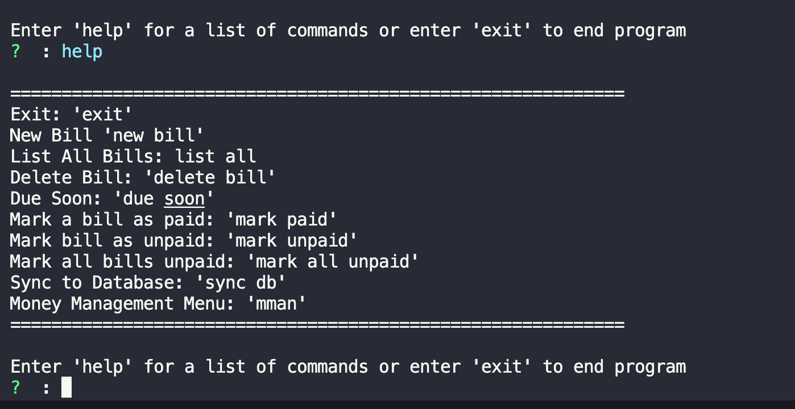
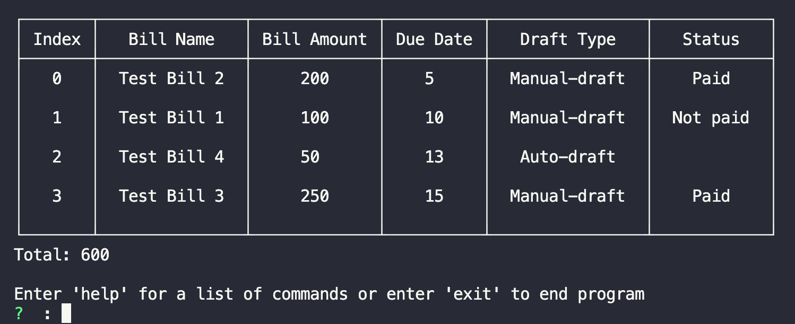
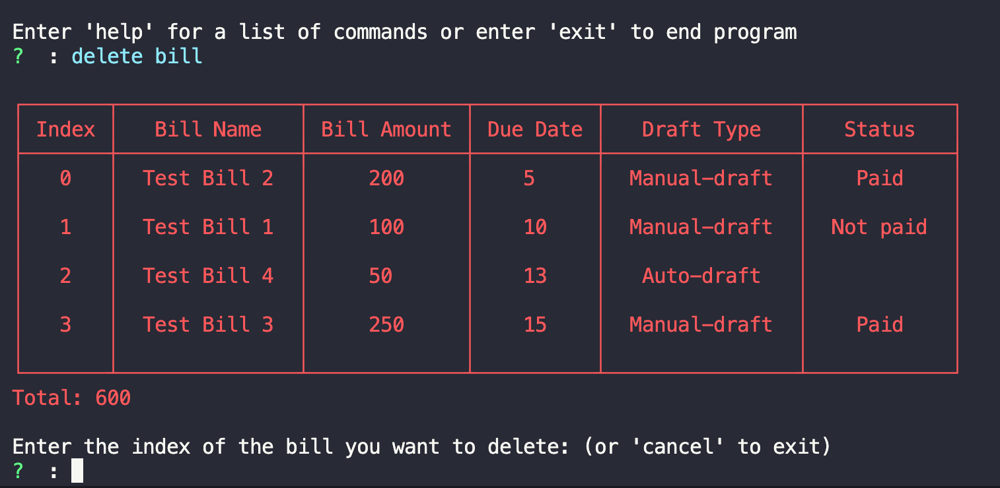
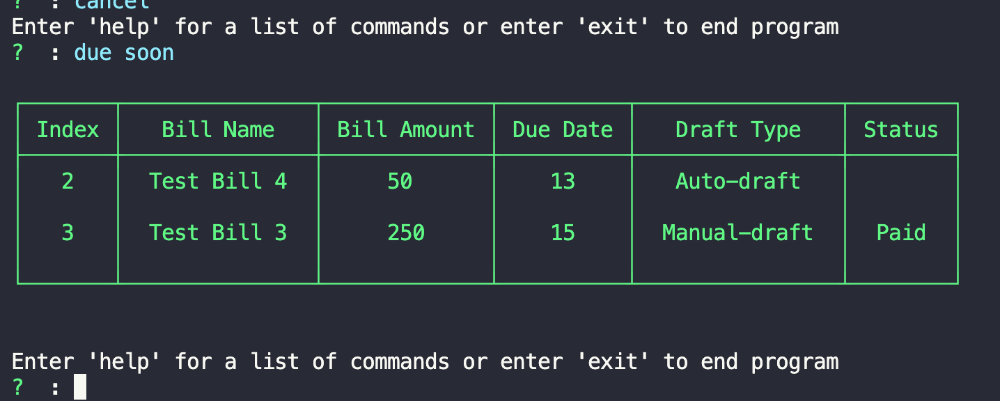

### Node.js/Typescript bill tracking CLI
- Intended to be a simple CLI used to track bills that I built for personal use and as fun practice project. I also used this as a introduction to typescript (I definitely slacked on uitilizing the type system but ill fix that one day).

- The only dependency being used is inquirer.js for user input.

- All of the data is stored locally in a json file (bills.json).

#### List of commands that can be entered

- **exit** - End the program.
- **new bill** - Bring up prompt for a new bill.
- **list all** - Prints table of all your bills to terminal.
- **delete bill** - Prints table of bills and gives you a prompt to enter the index of the bill you want to delete.
- **due soon** - Prints a table of all your bills due with in the next 5 days.
- **mark paid** - Prints a table and prompts for a index of the bill you want to mark as paid.
- **mark unpaid** - Does the same as mark paid except labels a bill as unpaid.
- **mark all unpaid** - Mark every bill as unpaid.
- **sync to database** - Currently does nothing.
- **mman** - Brings you to a second menu that is currently incomplete.

### List All Bills Table:

### Delete Bills Table:

### Due Soon Table:

